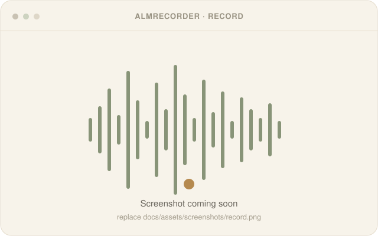
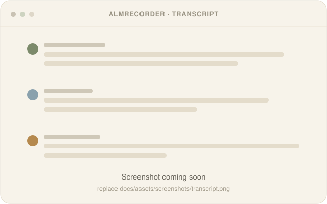
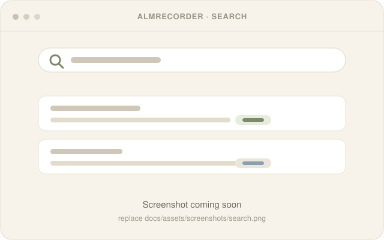

<div align="center">


# AlmRecorder

**Private, on-device speech transcription for macOS.**

Record or import Voice Memos and transcribe locally with whisper.cpp · Voxtral · Gemma —
then search, diarize, and organize. Nothing ever leaves your Mac.

[](#requirements)
[](#requirements)
[](#privacy)
[](LICENSE)
[](https://github.com/ViktorAlm/AlmRecorder/releases/latest)

[**Download**](https://github.com/ViktorAlm/AlmRecorder/releases/latest) · [User guide](docs/user-guide.md) · [Build from source](#build-from-source) · [Contribute](CONTRIBUTING.md)

</div>

---

## Screenshots

<table>
  <tr>
    <td width="50%"><br><sub><b>Record</b> — live waveform, one-tap local transcription</sub></td>
    <td width="50%"><br><sub><b>Transcript</b> — speaker-labeled, editable, exportable</sub></td>
  </tr>
  <tr>
    <td width="50%"><br><sub><b>Semantic search</b> — find by meaning across every recording</sub></td>
    <td width="50%" valign="middle"><sub>Screenshots are placeholders for now — drop curated, privacy-safe captures into <code>docs/assets/screenshots/</code> and update the paths above.</sub></td>
  </tr>
</table>

## Features

- **Recording** — real-time capture with a live waveform, then one-tap transcription.
- **Voice Memos import** — pull in Apple Voice Memos, or drag & drop audio, and batch-transcribe.
- **Multiple local engines** — [whisper.cpp](https://github.com/ggml-org/whisper.cpp), or Voxtral / Gemma via [llama.cpp](https://github.com/ggerganov/llama.cpp). No Python.
- **Semantic search** — transcripts are embedded locally and searchable by meaning, via a custom SQLite build + vector extensions.
- **Speaker diarization & identification** — "who spoke when," with labels you can correct.
- **Hallucination cleanup** — scores every line for whisper artifacts (silence fillers, repetition loops, subtitle boilerplate — language-agnostic), double-checks suspicious ones against the audio with Gemma, and learns from what it finds; everything reversible via a review inbox.
- **Automatic insights** — titles, summaries, and tags generated on-device for every recording.
- **Export** — TXT, CSV, or JSON; copy a line or a whole transcript.
- Native SwiftUI app, dark mode, sandbox-compatible with security-scoped bookmarks.

## Requirements

- macOS 14 (Sonoma) or later
- **Apple Silicon (M1 or later)** for the prebuilt download (bundled native libraries are arm64)
- ~3 GB free disk for a quantized model; 8 GB RAM minimum, 16 GB recommended
- Models are **downloaded on first run** — they are not bundled.

## Download & run

1. Download the latest `AlmRecorder.dmg` from the [Releases page](https://github.com/ViktorAlm/AlmRecorder/releases/latest).
2. Open the `.dmg` and drag **AlmRecorder** to your Applications folder.
3. **First launch (unsigned app).** AlmRecorder is open source but not Apple-notarized, so Gatekeeper warns on first open. Use any one of:
   - **Right-click** the app → **Open** → **Open**, or
   - **System Settings → Privacy & Security** → **Open Anyway**, or
   - Terminal: `xattr -dr com.apple.quarantine /Applications/AlmRecorder.app`
4. On first run, pick an engine and let the app **download its model**. After that you're fully offline.

For first-run permissions, recording, importing, search, transcript review, backups, MCP, and
troubleshooting, see the [complete user guide](docs/user-guide.md).

Prefer not to run an unsigned binary? [Build from source](#build-from-source).

## Build from source

```bash
git clone --recurse-submodules https://github.com/ViktorAlm/AlmRecorder.git
cd AlmRecorder
swift build
swift run        # or: ./Scripts/run_dev_app.sh
```

The app ships prebuilt `whisper.cpp` / `llama.cpp` / `vectorlite` / custom-SQLite libraries under
`AlmRecorder/Resources/`, so a plain `swift build` works without compiling any C++. To rebuild those,
see [`CONTRIBUTING.md`](CONTRIBUTING.md) and [`GRDBCustom/REGENERATING.md`](GRDBCustom/REGENERATING.md).

To package an unsigned `.dmg` yourself: `./Scripts/package_dmg.sh`.

## How it works

- **UI** — SwiftUI, AVFoundation for capture.
- **Transcription** — routed to whisper.cpp or llama.cpp (Voxtral / Gemma) by a unified manager with a retry/progress job queue.
- **Storage & search** — [GRDB](https://github.com/groue/GRDB.swift) on a custom SQLite build (extension loading enabled) with [vectorlite](https://github.com/1yefuwang1/vectorlite) / [sqlite-vec](https://github.com/asg017/sqlite-vec) for HNSW vector search.
- **Diarization** — [FluidAudio](https://github.com/FluidInference/FluidAudio) embeddings + [DBSCAN](https://github.com/mattt/DBSCAN) clustering.

Deeper notes live in [`docs/`](docs/).

## Privacy

All recording, transcription, embedding, and search happen locally on your Mac. No audio or text is
uploaded anywhere. Models are downloaded once from their public sources and then run offline.
Recordings are stored under `~/Library/Application Support/AlmRecorder/Recordings/`.

The source repository contains no recording or transcript corpus, identity labels, gold set,
comparison output, or test/evaluation fixture. Evaluation uses only the current user's local
library and locally stored labels. See [`PRIVACY.md`](PRIVACY.md) for the repository boundary.

## License

Apache License 2.0 — see [`LICENSE`](LICENSE). Third-party components and their licenses are in
[`THIRD-PARTY-NOTICES.md`](THIRD-PARTY-NOTICES.md). **AI models are downloaded at runtime and carry
their own licenses** — in particular Google's **Gemma** is governed by the
[Gemma Terms of Use](https://ai.google.dev/gemma/terms), not by this repository's license.

<div align="center"><sub>Logo & identity: an <b>A</b> built from a microphone, in Swedish kitchen-cabinet colors. See <a href="docs/assets/logo/index.html">the brand sheet</a>.</sub></div>
