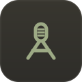
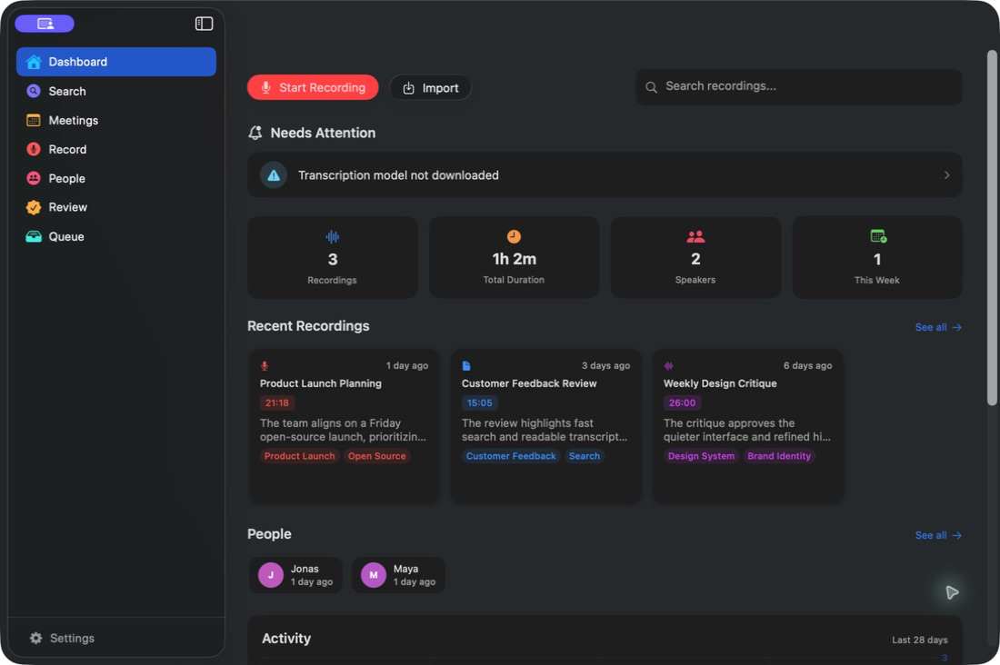
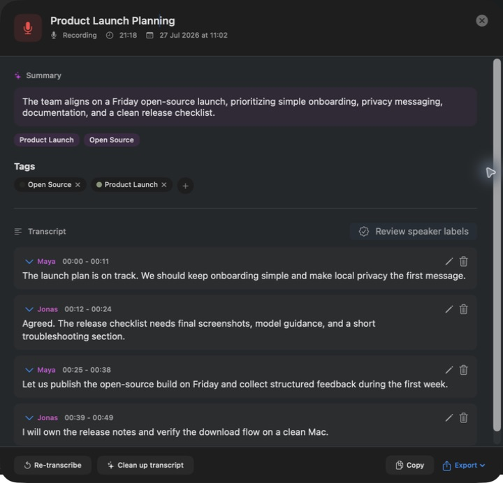
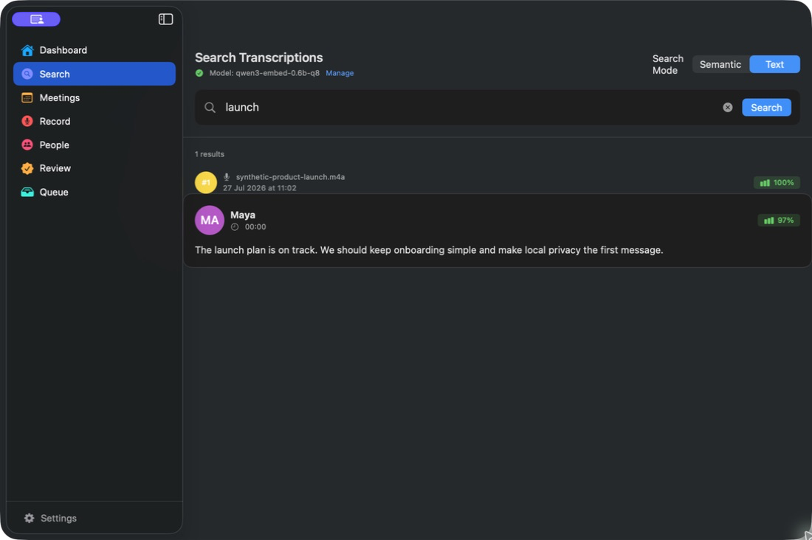

<div align="center">



# AlmRecorder

**Open-source, private, on-device speech transcription for macOS.**

Record or import Voice Memos, transcribe locally with VibeVoice or whisper.cpp, and optionally run
the full VibeVoice → Whisper → Gemma audio quality pass—then search, diarize, and organize.

[](#requirements)
[](#requirements)
[](#privacy)
[](LICENSE)
[](https://github.com/ViktorAlm/AlmRecorder/releases/latest)

[**Download**](https://github.com/ViktorAlm/AlmRecorder/releases/latest) · [Build from source](#build-from-source) · [Contribute](CONTRIBUTING.md) · [Security](SECURITY.md) · [Enterprise analytics](#enterprise-conversation-analytics)

</div>

---

## Product preview

<table>
  <tr>
    <td width="50%"><br><sub><b>Dashboard</b> — recent recordings, activity, and speakers at a glance</sub></td>
    <td width="50%"><br><sub><b>Transcript</b> — speaker-labeled, editable, exportable</sub></td>
  </tr>
  <tr>
    <td colspan="2"><br><sub><b>Search</b> — find exact phrases or use semantic search across every recording</sub></td>
  </tr>
</table>

<p align="center"><sub>All screenshots use synthetic demo recordings and transcripts.</sub></p>

## Features

- **Recording** — real-time capture with a live waveform, then one-tap transcription.
- **Voice Memos import** — pull in Apple Voice Memos, or drag & drop audio, and batch-transcribe.
- **Multiple local engines** — VibeVoice-ASR with native speaker turns, [whisper.cpp](https://github.com/ggml-org/whisper.cpp),
  and Voxtral via [llama.cpp](https://github.com/ggerganov/llama.cpp).
- **Three-stage quality pass** — preserves VibeVoice speaker turns, obtains independent Whisper
  Large v3 evidence, then lets audio-capable Gemma reconcile disputed spans. Every stage is local,
  checkpointed, and memory-gated.
- **Semantic search** — transcripts are embedded locally and searchable by meaning, via a custom SQLite build + vector extensions.
- **Speaker diarization & identification** — "who spoke when," with labels you can correct.
- **Hallucination review** — scores every line for silence fillers, repetition loops, script
  outliers, and model-confidence evidence. Hard evidence can be hidden reversibly; uncertain lines
  remain in the review inbox. Gemma audio adjudication belongs to the optional three-stage pass.
- **Automatic insights** — titles, summaries, and tags generated on-device for every recording.
- **Export** — TXT, CSV, or JSON; copy a line or a whole transcript.
- Native SwiftUI app, dark mode, with security-scoped bookmarks for user-authorized files.

## Requirements

- macOS 14 (Sonoma) or later
- **Apple Silicon (M1 or later)** for the prebuilt download (bundled native libraries are arm64)
- Standard transcription: at least 8 GB free disk and 16 GB unified memory recommended
- Full VibeVoice + Whisper Large v3 + Gemma quality pipeline: about 18 GB free disk and 24 GB
  unified memory recommended; its safety gate waits when memory headroom is insufficient
- Models are not bundled. Setup and the Models screen explain each download before starting it.

## Download & run

1. Download `AlmRecorder-<version>-community.dmg` and its `.sha256` file from the
   [Releases page](https://github.com/ViktorAlm/AlmRecorder/releases/latest), then verify it with
   `shasum -a 256 -c AlmRecorder-<version>-community.dmg.sha256`.
2. Open the `.dmg` and drag **AlmRecorder** to your Applications folder.
3. The community build is ad-hoc signed but is not signed with an Apple Developer ID or notarized.
   In Applications, Control-click (or right-click) **AlmRecorder**, choose **Open**, and confirm if
   macOS offers that choice. If it remains blocked, try opening it once, then use **System Settings
   → Privacy & Security → Open Anyway** within about an hour of that attempt. Only make this
   exception for the verified artifact from the official release page. No Terminal command or
   system-wide Gatekeeper change is needed. See [Apple's current instructions](https://support.apple.com/guide/mac-help/mh40616/mac).
4. On first run, pick an engine and explicitly install the model(s) you want. After setup, inference
   works offline.

## Build from source

```bash
git clone --recurse-submodules https://github.com/ViktorAlm/AlmRecorder.git
cd AlmRecorder
swift build
swift run        # or: ./Scripts/run_dev_app.sh
```

The app ships prebuilt `whisper.cpp` / `llama.cpp` / `vectorlite` / custom-SQLite libraries under
`AlmRecorder/Resources/`, so a plain `swift build` works without compiling any C++. To rebuild those,
see [`CONTRIBUTING.md`](CONTRIBUTING.md) and [`GRDBCustom/REGENERATING.md`](GRDBCustom/REGENERATING.md).

To make the public community build without a paid Apple developer account:

```bash
ALMREC_RELEASE_CHANNEL=community ./Scripts/package_dmg.sh
```

This produces `dist/AlmRecorder-<version>-community.dmg` plus a verified `.sha256` sidecar and
includes first-launch instructions in the DMG. For a local-only packaging smoke test:

```bash
ALMREC_ALLOW_ADHOC=1 ./Scripts/package_dmg.sh
```

Developer ID signing and Apple notarization remain an optional second release channel; see
[`docs/RELEASE_CHECKLIST.md`](docs/RELEASE_CHECKLIST.md).

## How it works

- **UI** — SwiftUI, AVFoundation for capture.
- **Transcription** — VibeVoice, Whisper, or Voxtral foreground jobs are routed through a durable
  retry/progress queue. The optional nightly quality controller runs the separate VibeVoice →
  Whisper → Gemma audio consensus pipeline.
- **Storage & search** — [GRDB](https://github.com/groue/GRDB.swift) on a custom SQLite build (extension loading enabled) with [vectorlite](https://github.com/1yefuwang1/vectorlite) / [sqlite-vec](https://github.com/asg017/sqlite-vec) for HNSW vector search.
- **Diarization** — [FluidAudio](https://github.com/FluidInference/FluidAudio) embeddings + [DBSCAN](https://github.com/mattt/DBSCAN) clustering.

Deeper notes live in [`docs/`](docs/).

## Privacy

All recording, transcription, embedding, and search happen locally on your Mac. AlmRecorder does
not upload audio or text. Models are downloaded once from their public sources and then run
offline. If you enable the optional MCP server, a connected client may send retrieved data to an
external service; recordings can be excluded individually or automatically through privacy tags.
Recordings are stored under `~/Library/Application Support/AlmRecorder/Recordings/`.

The source repository contains no recording or transcript corpus, identity labels, gold set,
comparison output, or test/evaluation fixture. Evaluation uses only the current user's local
library and locally stored labels. See [`PRIVACY.md`](PRIVACY.md) for the repository boundary.

## Enterprise conversation analytics

AlmRecorder is built for private, on-device workflows on a Mac. If your organization needs
customer-conversation analytics at enterprise scale — including programs processing millions of
calls — visit [**labelf.ai**](https://labelf.ai).

AlmRecorder is created and maintained by
[Viktor Alm](https://github.com/ViktorAlm), CEO of [labelf.ai](https://labelf.ai).

## License

Apache License 2.0 — see [`LICENSE`](LICENSE). Third-party components and their licenses are in
[`THIRD-PARTY-NOTICES.md`](THIRD-PARTY-NOTICES.md). **AI models are downloaded at runtime and carry
their own licenses** — in particular Google's **Gemma** is governed by the
[Gemma Terms of Use](https://ai.google.dev/gemma/terms), not by this repository's license.

<div align="center"><sub>Logo & identity: a transparent speech-ribbon <b>A</b> with a horizontal studio-microphone crossbar, in sage and charcoal. See <a href="docs/design/logo/AlmRecorder-ribbon-A-blue-yeti-reference.svg">the approved SVG</a>.</sub></div>
